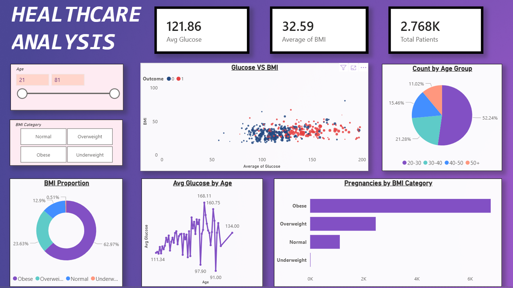

# 📊 Healthcare Diabetes Analysis Dashboard (Power BI)

##  Overview

This project presents an interactive healthcare dashboard built using Power BI to analyze diabetes-related patient data.  

The dashboard focuses on identifying key health indicators, risk patterns, and relationships between variables such as glucose, BMI, age, and pregnancies.

It enables users to explore data dynamically and gain actionable insights for diabetes risk analysis.

---

## 🎯 Objectives

* Analyze key health metrics influencing diabetes  
* Identify relationships between Glucose, BMI, and Outcome  
* Understand distribution across Age Groups and BMI Categories  
* Perform EDA-driven insights using visualizations  
* Build an interactive dashboard for better decision-making  

---

## 📊 Key Metrics

* 🧪 Avg Glucose: **121.86**  
* ⚖️ Avg BMI: **32.59**  
* 👥 Total Patients: **2.768K**  

---

## 🎛 Dashboard Features

### 🔹 Filters (Slicers)

* Age (Range Slider)  
* BMI Category (Normal, Overweight, Obese, Underweight)  

---

### 🔹 KPI Cards

* Average Glucose  
* Average BMI  
* Total Patients  

---

### 🔹 Visualizations

* 🔵 Scatter Plot  
  - Glucose vs BMI (colored by Outcome)  
  - Identifies high-risk clusters  

* 🍩 Donut Chart (Age Group Distribution)  
  - Shows patient distribution across age groups  

* 🍩 BMI Proportion Chart  
  - Displays distribution of BMI categories  

* 📈 Line Chart (Avg Glucose by Age)  
  - Shows trend of glucose levels with increasing age  

* 📊 Bar Chart (Pregnancies by BMI Category)  
  - Compares pregnancy counts across BMI groups  

---

## 🔍 Key Insights

*  Higher glucose levels are strongly associated with diabetes  
*  Obese individuals show higher health risk indicators  
*  Glucose levels tend to increase with age  
*  BMI plays a significant role in diabetes prediction  
* Majority of patients fall under overweight/obese categories  

---

## 📷 Dashboard Preview

---

## 🛠️ Tools Used

* 🐍 Python (Pandas, NumPy) — Data Cleaning & EDA  
* 📊 Power BI — Dashboard & Visualization  
* 📄 Excel — Data preparation/export  

---

## 📂 Project Workflow

1. Data Cleaning using Pandas  
   - Handling missing values (zero → NaN)  
   - Removing inconsistencies  

2. Exploratory Data Analysis  
   - Univariate, Bivariate, Multivariate analysis  

3. Data Export  
   - Cleaned dataset exported to Excel  

4. Dashboard Creation  
   - Interactive visuals built in Power BI  

---

## 🚀 How to Use

1. Open the `.pbix` file in Power BI Desktop  
2. Use slicers (Age, BMI Category) to filter data  
3. Hover over visuals to explore detailed insights  
4. Analyze patterns and relationships  

---

## 👩‍💻 Author

**Maroofa**  
Aspiring Data Analyst  

---

## 💡 Project Highlights

* End-to-end EDA pipeline (Python → Power BI)  
* Real-world healthcare dataset analysis  
* Interactive and visually appealing dashboard  
* Built within a short time frame showcasing strong analytical skills  
